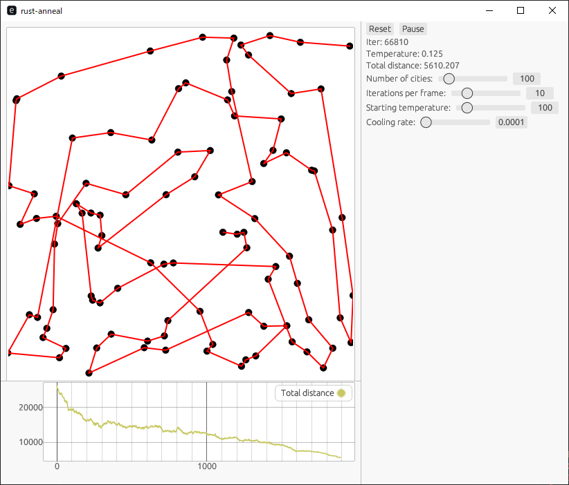

# Rust-anneal

A simulated annealing demo program to heuristically solve [TSP](https://en.wikipedia.org/wiki/Travelling_salesman_problem) in Rust

I'm pretty sure there are hundreds of people already done this in Rust.
However, I just wanted to make an easy to use GUI application to see it in action.

We use eframe to render the graphics.

Video:

https://github.com/user-attachments/assets/c9b4220b-580e-4536-b475-2b75d820e02d

## How to run

* Install Rust.
* `cargo r`
